# Prédiction du Churn Client — PySpark & Databricks

> Portfolio Data / Machine Learning de bout en bout construit à partir d’un **notebook Databricks réellement exécuté** : compréhension métier → qualité des données → EDA → feature engineering → encodage PySpark compatible serverless → Spark ML → analyse du seuil → scoring client → actions de rétention.

[Notebook exécuté](notebooks/telco_customer_churn_databricks_with_native_plots.ipynb) · [Model card](docs/model_card.md) · [Dictionnaire des données](docs/data_dictionary.md) · [Reproductibilité](docs/reproducibility.md) · [English version](README.md)

---

## Vue d’ensemble

| Élément | Résultat exécuté |
|---|---:|
| Clients | **7 043** |
| Colonnes brutes | **21** |
| Churners | **1 869** |
| Taux de churn global | **26,54 %** |
| Runtime | **Databricks Free Edition / Spark 4.1.0** |
| Train / test | **5 634 / 1 409** |
| Dimensions prédictives | **32** |
| Modèles | Régression Logistique, Random Forest |
| Champion ROC-AUC | **Régression Logistique** |
| ROC-AUC LR | **0,8369** |
| PR-AUC LR | **0,6347** |
| Recall churn LR @ 0,50 | **47,52 %** |
| Seuil exploratoire maximisant le F1 churn | **0,30** |
| Recall churn @ 0,30 | **76,24 %** |

**Intégrité de l’exécution :** le notebook fourni contient **31 cellules, 64 sorties enregistrées, 19 graphiques PNG natifs et aucune sortie d’erreur**. Tous les graphiques affichés ci-dessous sont les sorties Matplotlib originales du notebook exécuté ; ils n’ont été ni redessinés ni restylisés.

---

## 1. Question métier

> **Comment identifier suffisamment tôt les clients présentant un risque élevé de churn afin de prioriser les actions de fidélisation ?**

Le projet ne se limite pas à prédire `Churn = Yes/No`. Il relie les signaux descriptifs, les scores de modèle, le choix du seuil et la capacité opérationnelle à intervenir.

```text
Compréhension métier
        ↓
Qualité des données
        ↓
Analyse exploratoire
        ↓
Nettoyage + feature engineering
        ↓
Split train / test
        ↓
Encodage catégoriel PySpark compatible serverless
        ↓
VectorAssembler
        ↓
Régression Logistique + Random Forest
        ↓
Évaluation
        ↓
Analyse des seuils
        ↓
Scoring client
        ↓
Segmentation du risque
        ↓
Actions de rétention
```

---

## 2. Environnement et chargement

Le run a été exécuté avec **Spark 4.1.0** dans Databricks Free Edition / serverless. Le CSV est chargé via un widget `dataset_path` pointant vers un Volume Databricks.

Le dataset observé comporte **7 043 lignes et 21 colonnes brutes**. Le CSV brut n’est pas ajouté artificiellement à ce nouveau dépôt car il n’était pas inclus dans le notebook fourni ; voir [`data/README.md`](data/README.md).

---

## 3. Qualité des données

Le principal point de qualité concerne `TotalCharges` :

- **11 valeurs vides** ;
- les 11 clients ont `tenure = 0` ;
- les lignes sont conservées ;
- la valeur historique vide est remplacée par `0.0` avant conversion en `double`.

---

# 4. Analyse exploratoire

Les résultats suivants sont des **associations descriptives et non des effets causaux**.

## 4.1 Distribution de la cible

| Churn | Clients | Part |
|---|---:|---:|
| No | 5 174 | 73,46 % |
| **Yes** | **1 869** | **26,54 %** |

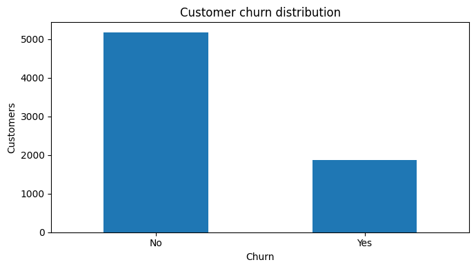

## 4.2 Contrat

| Contrat | Clients | Churners | Taux de churn |
|---|---:|---:|---:|
| **Month-to-month** | 3 875 | 1 655 | **42,71 %** |
| One year | 1 473 | 166 | 11,27 % |
| Two year | 1 695 | 48 | 2,83 % |

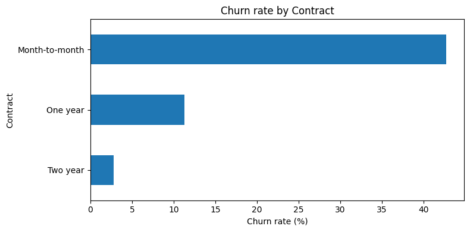

## 4.3 InternetService

| InternetService | Clients | Churners | Taux de churn |
|---|---:|---:|---:|
| **Fiber optic** | 3 096 | 1 297 | **41,89 %** |
| DSL | 2 421 | 459 | 18,96 % |
| No | 1 526 | 113 | 7,40 % |

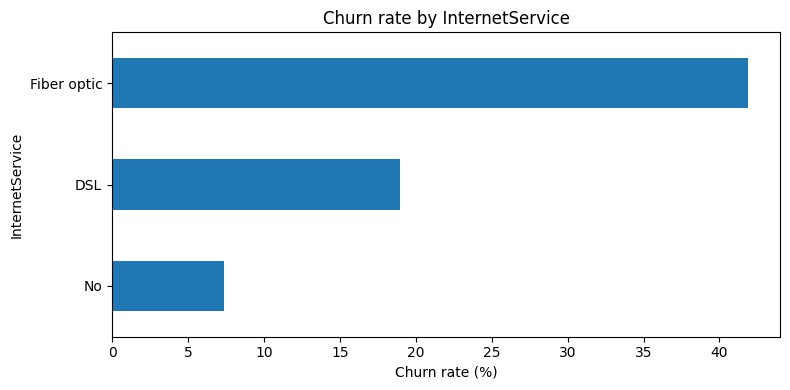

## 4.4 PaymentMethod

| Moyen de paiement | Clients | Churners | Taux de churn |
|---|---:|---:|---:|
| **Electronic check** | 2 365 | 1 071 | **45,29 %** |
| Mailed check | 1 612 | 308 | 19,11 % |
| Bank transfer (automatic) | 1 544 | 258 | 16,71 % |
| Credit card (automatic) | 1 522 | 232 | 15,24 % |

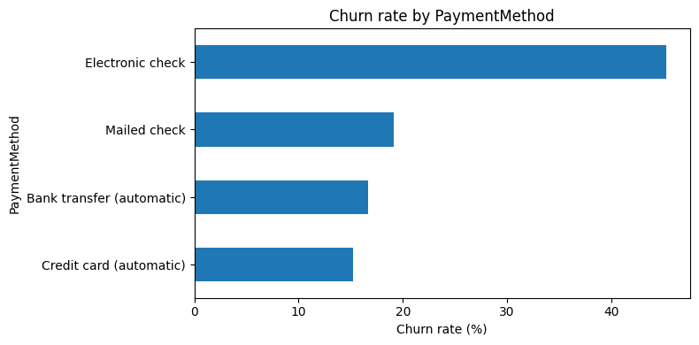

## 4.5 TechSupport

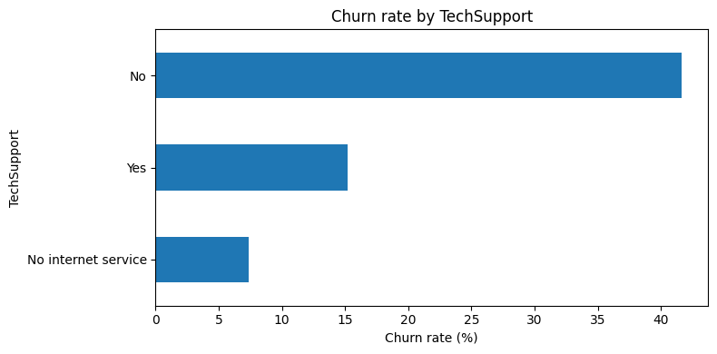

- No : **41,64 %**
- Yes : 15,17 %
- No internet service : 7,40 %

## 4.6 OnlineSecurity


- No : **41,77 %**
- Yes : 14,61 %
- No internet service : 7,40 %

## 4.7 SeniorCitizen

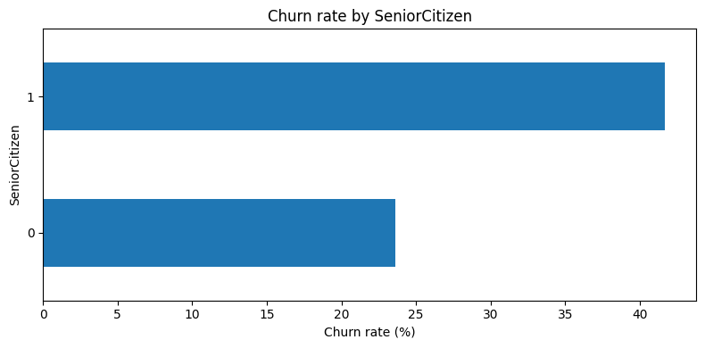

- Senior = 1 : **41,68 %**
- Senior = 0 : 23,61 %

Cette différence doit être accompagnée d’une analyse d’équité et des performances par sous-groupe avant utilisation opérationnelle.

## 4.8 PaperlessBilling


- Yes : **33,57 %**
- No : 16,33 %

## 4.9 Partner

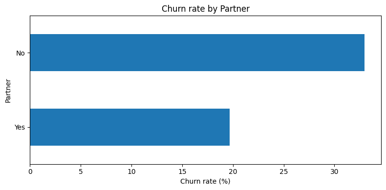

- No : **32,96 %**
- Yes : 19,66 %

## 4.10 Dependents

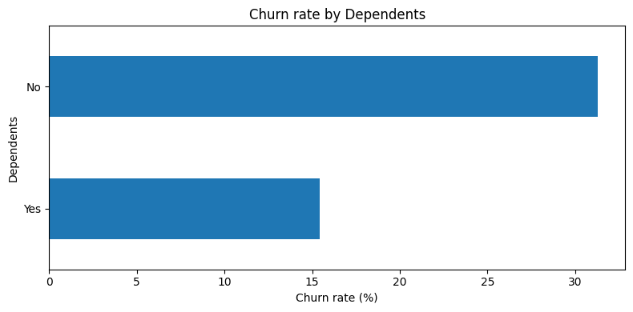

- No : **31,28 %**
- Yes : 15,45 %

## 4.11 Gender

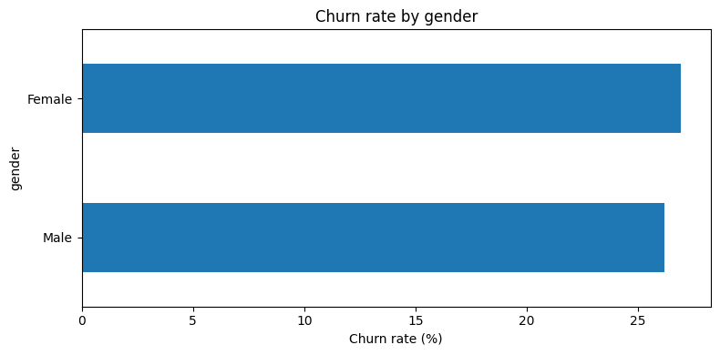

- Female : 26,92 %
- Male : 26,16 %

La différence descriptive est très faible.

## 4.12 Ancienneté

| Groupe | Ancienneté moyenne | Médiane |
|---|---:|---:|
| Non-churn | 37,57 mois | 38 |
| **Churn** | **17,98 mois** | **10** |

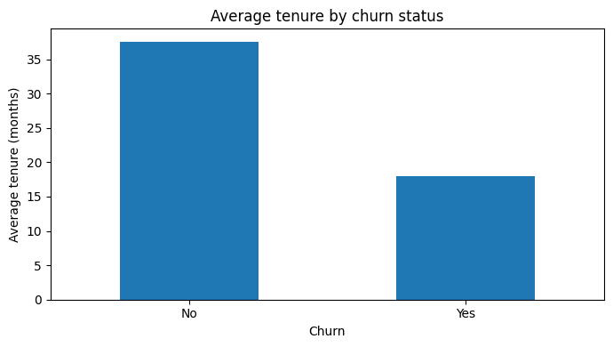

## 4.13 MonthlyCharges

| Groupe | MonthlyCharges moyen |
|---|---:|
| Non-churn | 61,27 |
| **Churn** | **74,44** |

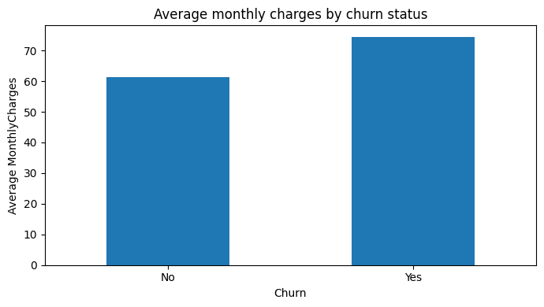

---

# 5. Nettoyage et feature engineering

`customerID` est conservé pour le scoring client mais exclu des variables prédictives.

Deux variables sont construites :

- `num_services` : nombre de services actifs parmi huit options télécom ;
- `charges_per_month` : `TotalCharges / tenure` si `tenure > 0`, sinon `MonthlyCharges`.

---

# 6. Split train / test

```python
train_df, test_df = df.randomSplit([0.8, 0.2], seed=42)
```

| Jeu | Non-churn | Churn | Total |
|---|---:|---:|---:|
| Train | 4 148 | 1 486 | **5 634** |
| Test | 1 026 | 383 | **1 409** |

Le split est effectué avant l’apprentissage du vocabulaire catégoriel.

---

# 7. Encodage catégoriel compatible serverless

Pour limiter l’accumulation de modèles Spark ML dans le cache Spark Connect, le notebook n’utilise pas une chaîne de nombreux `StringIndexerModel` / `OneHotEncoderModel`.

Il apprend les modalités uniquement sur le **train**, les trie de façon déterministe, omet une modalité de référence, crée les variables dummy avec des expressions PySpark et construit le vecteur avec `VectorAssembler`.

Le vecteur final contient **32 dimensions prédictives**.

---

# 8. Cadre d’évaluation

Les métriques utilisées sont : ROC-AUC, PR-AUC, Accuracy, Weighted F1, Precision churn, Recall churn, F1 churn, TN, FP, FN et TP.

Dans une logique de rétention, les **faux négatifs** sont particulièrement importants : ils correspondent à des churners réels qui ne sont pas détectés.

---

# 9. Régression Logistique

| Métrique | Résultat |
|---|---:|
| ROC-AUC | **0,8369** |
| PR-AUC | 0,6347 |
| Accuracy | 0,7921 |
| F1 pondéré | 0,7800 |
| Precision churn | 0,6642 |
| Recall churn | 0,4752 |
| F1 churn | 0,5540 |
| TN / FP / FN / TP | 934 / 92 / 201 / 182 |

---

# 10. Analyse du seuil — Régression Logistique

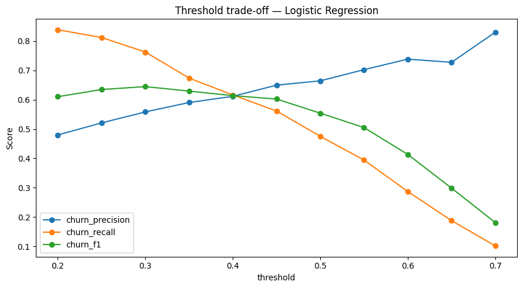

| Seuil | Precision | Recall | F1 churn | FP | FN |
|---:|---:|---:|---:|---:|---:|
| 0,20 | 0,4798 | 0,8381 | 0,6103 | 348 | 62 |
| 0,25 | 0,5209 | 0,8120 | 0,6347 | 286 | 72 |
| **0,30** | **0,5583** | **0,7624** | **0,6446** | 231 | 91 |
| 0,35 | 0,5904 | 0,6736 | 0,6293 | 179 | 125 |
| 0,40 | 0,6114 | 0,6162 | 0,6138 | 150 | 147 |
| 0,45 | 0,6495 | 0,5614 | 0,6022 | 116 | 168 |
| 0,50 | 0,6642 | 0,4752 | 0,5540 | 92 | 201 |
| 0,55 | 0,7023 | 0,3943 | 0,5050 | 64 | 232 |
| 0,60 | 0,7383 | 0,2872 | 0,4135 | 39 | 273 |
| 0,65 | 0,7273 | 0,1880 | 0,2988 | 27 | 311 |
| 0,70 | 0,8298 | 0,1018 | 0,1814 | 8 | 344 |

Le seuil exploratoire **0,30** maximise le F1 churn sur ce jeu de test et augmente le recall de **47,52 % à 76,24 %**.

Il ne s’agit **pas d’un seuil de production recommandé** : la sélection doit être faite sur validation en intégrant coûts, capacité commerciale et valeur client.

---

# 11. Scoring client et segmentation du risque

| Segment | Clients | Score moyen |
|---|---:|---:|
| Critical | **9** | 0,8117 |
| High | **750** | 0,6750 |
| Medium | **1 869** | 0,4447 |
| Low | **4 415** | 0,1151 |

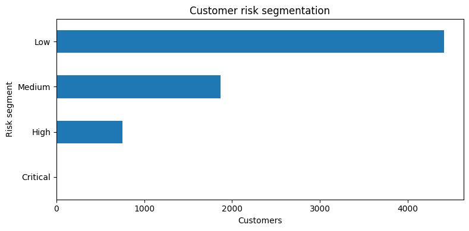

Ces bandes sont illustratives et ne constituent pas une calibration formelle des probabilités.

---

# 12. Random Forest

| Métrique | Résultat |
|---|---:|
| ROC-AUC | 0,8279 |
| PR-AUC | **0,6367** |
| Accuracy | 0,7814 |
| F1 pondéré | 0,7546 |
| Precision churn | **0,6943** |
| Recall churn | 0,3499 |
| F1 churn | 0,4653 |
| TN / FP / FN / TP | 967 / 59 / 249 / 134 |

## Feature importance

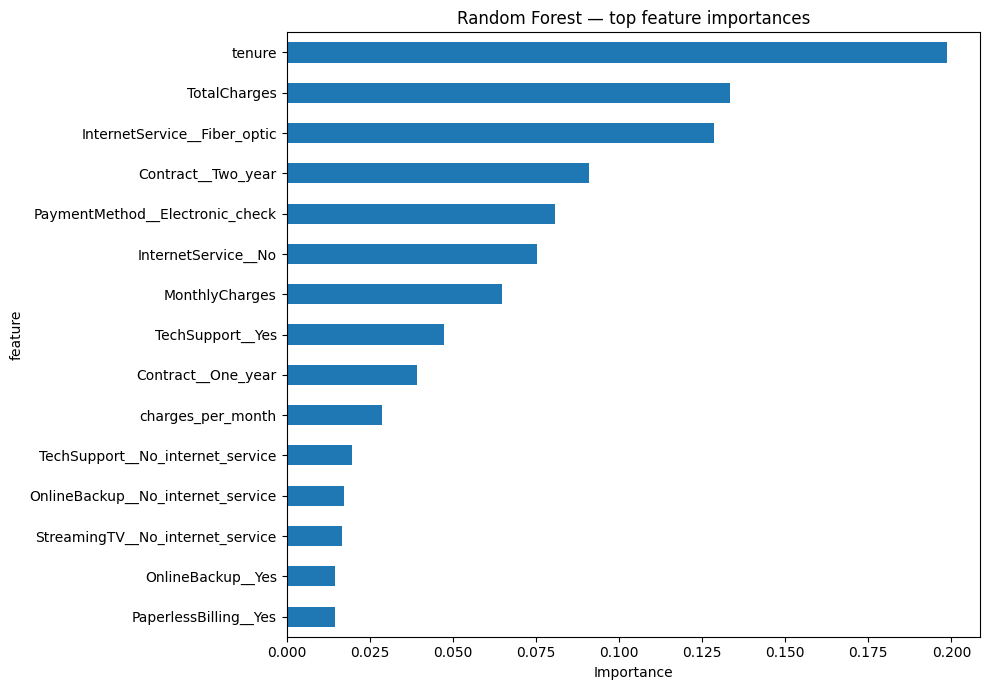

Les variables les plus importantes du run sont `tenure`, `TotalCharges`, `InternetService__Fiber_optic`, `Contract__Two_year` et `PaymentMethod__Electronic_check`.

Cette importance reflète l’utilisation des variables par le modèle, **pas un effet causal**.

---

# 13. Comparaison finale

| Métrique | Régression Logistique | Random Forest |
|---|---:|---:|
| **ROC-AUC** | **0,8369** | 0,8279 |
| PR-AUC | 0,6347 | **0,6367** |
| **Accuracy** | **0,7921** | 0,7814 |
| **F1 pondéré** | **0,7800** | 0,7546 |
| Precision churn | 0,6642 | **0,6943** |
| **Recall churn** | **0,4752** | 0,3499 |
| **F1 churn** | **0,5540** | 0,4653 |

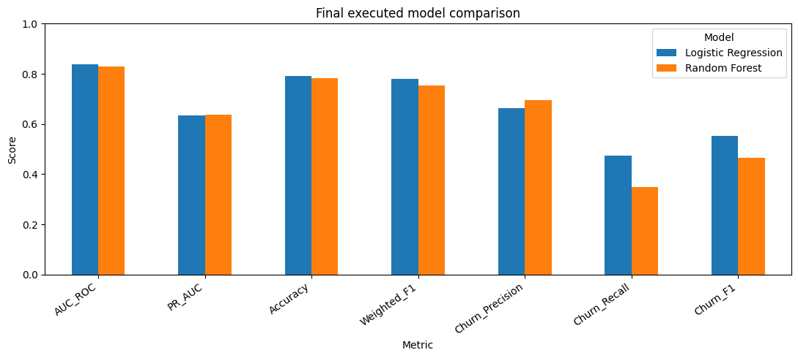

### Modèle retenu : Régression Logistique

Le notebook affiche explicitement **« Champion by ROC-AUC: Logistic Regression »**. À seuil 0,50, elle détecte également davantage de churners que la Random Forest.

## Matrices de confusion au seuil 0,50

### Régression Logistique

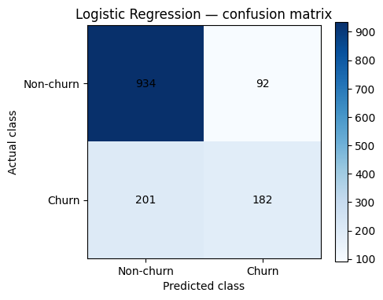

TN=934 · FP=92 · FN=201 · TP=182

### Random Forest


TN=967 · FP=59 · FN=249 · TP=134

La Random Forest produit moins de faux positifs mais manque davantage de churners.

---

# 14. Recommandations métier

| Priorité | Signal exécuté | Action à tester |
|---|---|---|
| 1 | Month-to-month **42,71 %** | Incitations vers des contrats plus longs pour les clients à risque |
| 2 | Médiane churner **10 mois** | Renforcer onboarding et support durant la première année |
| 3 | No TechSupport **41,64 %** / No OnlineSecurity **41,77 %** | Tester des bundles de services ciblés |
| 4 | Electronic check **45,29 %** | Étudier les frictions de paiement / engagement |
| 5 | Senior **41,68 %** | Support personnalisé avec contrôle d’équité |

Ces pistes doivent être validées expérimentalement.

---

# 15. Roadmap production

MLflow, Model Registry, scoring batch planifié, tables Delta de prédiction, seuil optimisé sur validation et coûts, contrôle de calibration, monitoring de drift, monitoring d’équité, stratégie de réentraînement et intégration CRM.

---

# 16. Limites

- dataset statique ;
- un seul split aléatoire ;
- tuning limité ;
- analyse du seuil effectuée sur le test ;
- pas de validation temporelle ;
- calibration non étudiée formellement ;
- pas d’inférence causale ;
- absence de données de coût de campagne ;
- pas de boucle de monitoring déployée.

---

# Conclusion

La **Régression Logistique** est le champion du run par ROC-AUC (**0,8369**) et présente un recall churn supérieur à la Random Forest au seuil 0,50.

L’enseignement métier central vient toutefois de l’analyse du seuil : passer de `0,50` à un seuil exploratoire de `0,30` fait passer le recall churn de **47,52 % à 76,24 %**, au prix d’un nombre plus élevé de faux positifs.

Le projet montre donc qu’en rétention, **le choix du point d’exploitation est aussi important que le classement des modèles**.
